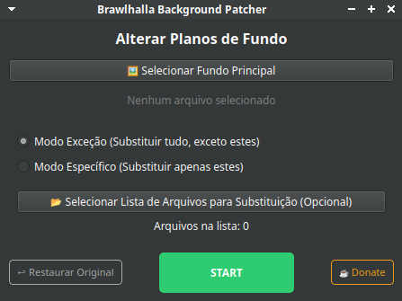
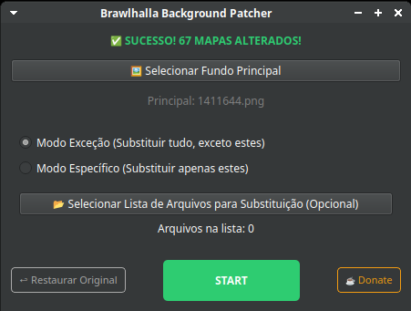
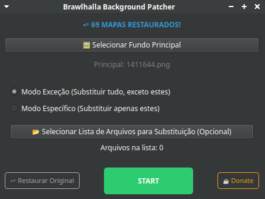
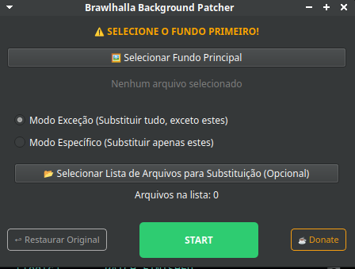
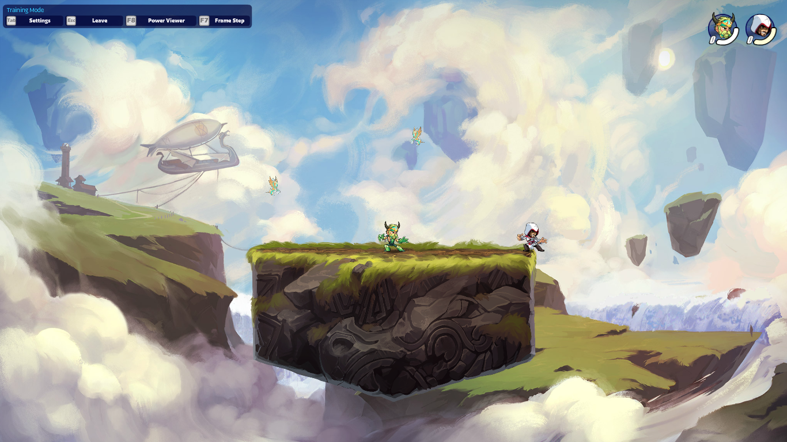
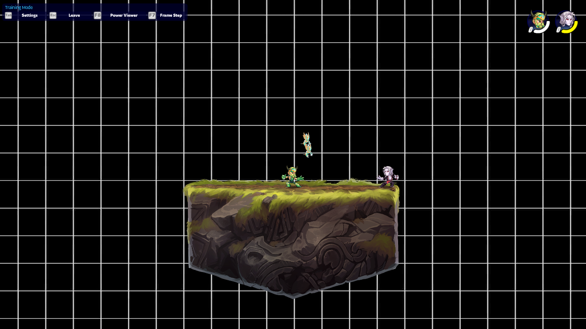

# BH Background Patcher


Ferramenta desktop para automatizar a substituição de backgrounds do Brawlhalla, com interface gráfica, backup, restauração e suporte a Windows, Linux e macOS.

## 📌 Sumário

- [📦 Downloads](#downloads)
- [✨ Funcionalidades](#funcionalidades)
- [🚀 Demonstrações](#demonstracoes)
- [⚠️ Backup e segurança](#backup-e-seguranca)
- [🎮 Configuração recomendada no Brawlhalla](#configuracao-recomendada-no-brawlhalla)
- [🧠 Decisões de projeto](#decisoes-de-projeto)
  - [Redimensionamento das imagens](#redimensionamento-das-imagens)
  - [Manipulação de caminhos com `pathlib`](#manipulacao-de-caminhos-com-pathlib)
  - [Preservação dos backups](#preservacao-dos-backups)
  - [Escolha do PySide6](#escolha-do-pyside6)
- [🧪 Testes e práticas de desenvolvimento](#testes-e-praticas-de-desenvolvimento)
  - [Exemplo](#exemplo)
- [🛠️ Tecnologias](#tecnologias)
- [📁 Estrutura do projeto](#estrutura-do-projeto)
- [🏗️ Como gerar os executáveis](#como-gerar-os-executaveis)

---

<a id="downloads"></a>
## 📦 Downloads

O BH Background Patcher é disponibilizado como executável para facilitar o uso.

### Windows

[⬇️ Baixar BHBP para Windows](../../releases/latest)

### Linux

[⬇️ Baixar BHBP para Linux](../../releases/latest)

> Os executáveis são gerados com PyInstaller e já incluem o interpretador Python
> e as dependências necessárias para executar o programa.
>
> Não é necessário instalar Python ou as bibliotecas do projeto para utilizar
> os executáveis distribuídos.

---

<a id="funcionalidades"></a>
## ✨ Funcionalidades

- 🔎 **Detecção automática da instalação:** tenta localizar a instalação padrão do Brawlhalla automaticamente em **Windows, Linux e macOS (Darwin)**.
- 🖥️ **Interface gráfica:** aplicação desktop desenvolvida com PySide6.
- 🧩 **Dois modos de aplicação:** permite selecionar entre os modos **Inserção** e **Exceção**, definindo quais mapas devem receber o background.
- 💾 **Backup automático:** realiza backup dos backgrounds atuais antes da aplicação do patch.
- ♻️ **Restauração persistente:** permite restaurar o backup salvo mesmo após fechar e reabrir o programa.
- 📝 **Sistema de logs:** utiliza `logging` para registrar as operações e facilitar diagnóstico e acompanhamento da execução.
- 💬 **Feedback na interface:** informa ao usuário o andamento e o resultado das operações, incluindo sucessos e erros.

---

<a id="demonstracoes"></a>
## 🚀 Demonstrações

### Janela principal



### Feedback de sucesso — modificação



### Feedback de sucesso — restauração



### Aviso de arquivo não selecionado



### Mapa antes



### Mapa depois



---

<a id="configuracao-recomendada-no-brawlhalla"></a>
## 🎮 Configuração recomendada no Brawlhalla

Para que o background personalizado seja exibido de forma limpa,
sem os efeitos visuais do mapa aparecendo sobre a imagem substituída,
é recomendado configurar o Brawlhalla para utilizar o plano de fundo
no modo **"Simples"**.

Com essa opção ativada, a imagem substituída pelo BHBP é exibida sem
a sobreposição dos efeitos visuais associados aos backgrounds dos mapas.

---

<a id="backup-e-seguranca"></a>
## ⚠️ Backup e segurança

O BHBP realiza automaticamente um backup dos backgrounds existentes
antes de aplicar um patch.

O backup é preservado e não é sobrescrito em execuções posteriores.
Dessa forma, o programa consegue restaurar o estado salvo através da
função de restore.

### Importante

Embora o BHBP possua um mecanismo próprio de backup, **não é recomendado
utilizá-lo como única forma de proteção dos arquivos do jogo**.

Antes de realizar alterações, recomenda-se manter uma segunda forma de
backup, como:

- recursos de backup/recuperação disponíveis pela Steam;
- cópias manuais dos arquivos;
- outros mecanismos de backup utilizados pelo usuário.

O backup do BHBP deve ser tratado como um mecanismo de recuperação da
aplicação, e não como substituto de uma estratégia de backup independente.

---

<a id="decisoes-de-projeto"></a>
## 🧠 Decisões de projeto

<a id="redimensionamento-das-imagens"></a>
### Redimensionamento das imagens

Os backgrounds do jogo possuem uma dimensão esperada de:

**2048 × 1151**

Durante o processamento, imagens maiores ou menores são ajustadas para
essa resolução.

O redimensionamento utiliza ImageOps.fit, em vez de simplesmente
deformar a imagem ou apenas reduzir suas dimensões.

Essa escolha permite:

- preservar a proporção da imagem;
- preencher completamente a resolução esperada;
- evitar deformações;
- cortar apenas o excesso necessário para atingir exatamente o tamanho alvo.

Essa decisão foi adotada após testar diferentes estratégias de
redimensionamento e observar que métodos que apenas preservam a proporção
poderiam resultar em dimensões finais incompatíveis com o formato esperado.

Ainda assim é recomendável que se opte por imagens com proporções e tamanho compatíveis.

<a id="manipulacao-de-caminhos-com-pathlib"></a>
### Manipulação de caminhos com `pathlib`

O projeto utiliza `pathlib.Path` como principal abstração para manipulação
de caminhos do sistema de arquivos.

A escolha evita depender diretamente da representação textual dos caminhos
e torna operações como composição de diretórios, verificação de existência,
criação de pastas e busca de arquivos mais claras.

Exemplos utilizados no projeto:

- composição de caminhos com `/`;
- `exists()` para validação;
- `glob()` para localizar backgrounds;
- `mkdir()` para criação do diretório de backup;
- `name` e `suffix` para inspeção dos arquivos.

Essa abordagem também facilita o suporte a diferentes sistemas
operacionais, permitindo que o código trabalhe com caminhos de forma
mais consistente entre Windows, Linux e macOS.

---

<a id="preservacao-dos-backups"></a>
### Preservação dos backups

O sistema não sobrescreve um backup que já exista.

Na criação do backup, cada arquivo é verificado individualmente:
se aquele arquivo ainda não possui uma cópia de backup, ela é criada;
caso contrário, o backup existente é preservado.

Isso evita que uma nova execução do patch destrua o estado salvo
anteriormente.

<a id="escolha-do-pyside6"></a>
### Escolha do PySide6

O **PySide6** foi escolhido como toolkit para a interface gráfica por
combinar uma API elegante e uma boa integração com o ambiente desktop.

O Qt utiliza os estilos apropriados para cada plataforma e seus widgets
podem acompanhar o look-and-feel nativo do sistema operacional, evitando
que a aplicação imponha uma identidade visual completamente diferente da
interface do usuário.

Além disso, a integração do Qt com o sistema de janelas permite utilizar
recursos nativos do ambiente, como cursores, fontes e outros elementos de
integração.

Essa característica foi considerada importante para manter o BHBP com
uma aparência natural no sistema em que estiver sendo executado, sem
sacrificar a portabilidade entre Windows, Linux e macOS.

---

<a id="testes-e-praticas-de-desenvolvimento"></a>
## 🧪 Testes e práticas de desenvolvimento

O projeto utiliza testes automatizados para validar comportamentos
específicos da aplicação.

Os testes foram utilizados não apenas para verificar se o código
executa sem erros, mas também para garantir regras importantes do comportamento esperado.

Foi adotado um método de verificação baseado em falha intencional: para validar um comportamento específico, o teste pode ser temporariamente alterado para provocar uma falha e confirmar que está protegendo exatamente a regra esperada.

Exemplos:

- backups existentes não devem ser sobrescritos;
- novos arquivos devem gerar backup;
- imagens processadas devem possuir a dimensão esperada;
- arquivos temporários devem ser removidos após o processamento;
- diferentes modos de seleção devem produzir os arquivos corretos.

A abordagem utilizada é orientada ao comportamento: cada teste procura
proteger uma regra específica do sistema contra regressões.

<a id="exemplo"></a>
### Exemplo

Um dos comportamentos protegidos pelos testes é a preservação de um
backup existente.

Se o arquivo já possuir uma cópia no diretório de backup, uma nova
execução não deve substituí-la.

---

<a id="tecnologias"></a>
## 🛠️ Tecnologias

- Python 3.12+
- PySide6
- Pillow
- pytest
- PyInstaller
- pathlib
- shutil
- logging

---

### Empacotamento

O projeto utiliza **PyInstaller** para gerar executáveis independentes,
permitindo a distribuição do aplicativo sem exigir que o usuário instale
Python ou as dependências do projeto.

---

<a id="estrutura-do-projeto"></a>
## 📁 Estrutura do projeto

```text
BH-Background-Patcher/
├── src/
│   ├── __init__.py
│   ├── main.py
│   ├── logic.py
│   ├── logger_setup.py
│   └── ui/
│       ├── __init__.py
│       ├── main_window.py
│       └── mode_selection.py
│
├── tests/
│   ├── __init__.py
│   └── test_logic.py
│
├── assets/
│   └── app_icon.ico
│
├── docs/
│   └── bhbp_logo.png
|   └── ...
│
├── requirements.txt
├── .gitignore
└── README.md
```

### Responsabilidades principais

- `logic.py` — regras de patch, backup, restauração e processamento das imagens.
- `logger_setup.py` — configuração centralizada do sistema de logs.
- `ui/` — componentes da interface gráfica.
- `tests/` — testes automatizados das regras do sistema.
- `assets/` — recursos utilizados pela aplicação.
- `docs/` — documentação e materiais visuais.

---

<a id="como-gerar-os-executaveis"></a>
## 🏗️ Como gerar os executáveis

O projeto utiliza **PyInstaller** para gerar executáveis independentes.

### Linux

A partir do ambiente virtual do projeto:

```bash
pyinstaller --clean --name BHBP --windowed --onefile --paths src src/main.py
```

O executável será gerado em:

```text
dist/BHBP
```

### Windows

O executável de Windows deve ser gerado em um ambiente Windows.

```powershell
pyinstaller --clean --name BHBP --windowed --onefile --paths src --icon docs/bhbp_logo.ico src/main.py
```

O resultado será:

```text
dist/
└── BHBP.exe
```

O PyInstaller empacota o interpretador Python e as dependências necessárias, permitindo que o usuário utilize o programa sem instalar Python ou as bibliotecas do projeto separadamente.